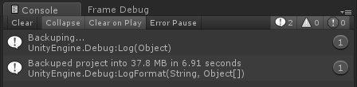
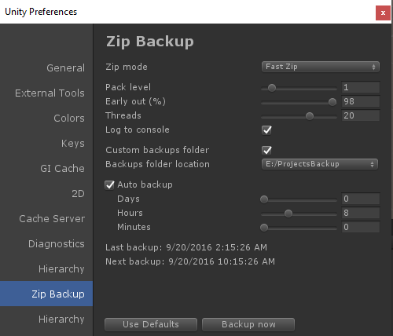

# Zip Backup

Unity extension to backup projects into zip files using 7z or [fastzip](http://forum.unity3d.com/threads/android-faster-apk-creation-experimental.327755/).

**Windows only**

## Known Issues

- Fast zip may fail to zip 3GB+ files, try using 7zip in these cases
